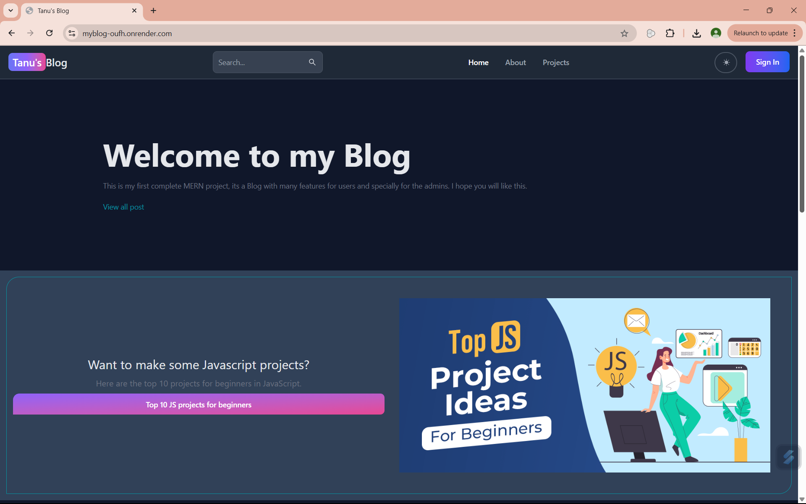
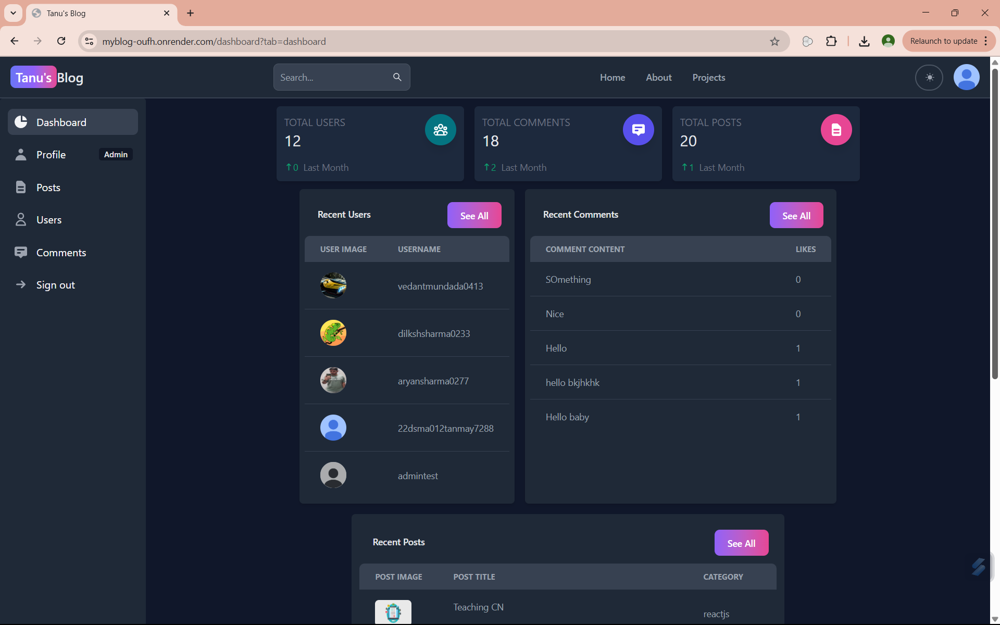
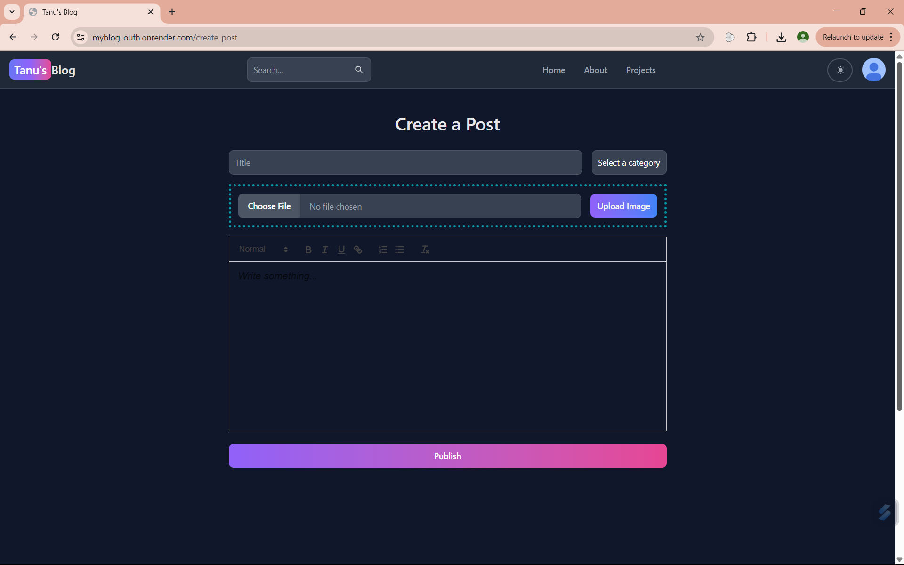

# 📝 BlogApp

A full-stack MERN blog application where **admins** can create blog posts, and **users** can comment on and like them. This is my first complete MERN project, and it's packed with useful features for both admins and users.

🌐 **Live Site:** [myblog-oufh.onrender.com](https://myblog-oufh.onrender.com)

---

## 🚀 Features

* 🧑‍💼 Admin dashboard with user, post, and comment management
* 📝 Rich-text editor for creating blog posts
* 📸 Image upload support via Firebase Storage
* 💬 Users can comment and like posts
* 🔒 Authentication using JSON Web Tokens (JWT)
* 🌙 Dark mode UI with responsive design
* 🔍 Post search functionality
* 📊 Dashboard analytics for admins

---

## 💠 Tech Stack

| Layer          | Tech                          |
| -------------- | ----------------------------- |
| Frontend       | React, Tailwind CSS, Flowbite, ReactQuill |
| Backend        | Node.js, Express.js, MongoDB  |
| Authentication | JSON Web Tokens (JWT)         |
| File Storage   | Firebase Storage              |
| Deployment     | Render                        |

---

## 📸 Screenshots

### 🏠 Home Page

---

### 📊 Admin Dashboard

---

### ✍️ Create a Post



---

## ⚙️ Getting Started

### 1. Clone the Repository

```bash
git clone https://github.com/Tanmay1Nandi/myBlog.git
cd myBlog
```

---

### 2. Backend Setup (`/api`)

```bash
cd api
npm install
```

Create a `.env` file in the `/api` folder:

```env
MONGO_URL=your_mongodb_connection_string
JWT_SECRET=your_jwt_secret
PORT=5000
```

Start the backend server:

```bash
npm run dev
```

---

### 3. Frontend Setup (`/client`)

```bash
cd ../client
npm install
npm start
```

The frontend will run on: `http://localhost:3000`

---

## 🧰 Test Admin Access

To try out admin features (dashboard, post creation, etc.), register a new user and update their role from the backend database or create an admin account manually.

---

## 📦 Deployment

The app is deployed on [Render](https://render.com/). It will auto-deploy when you push to the `main` branch.

---


## 🙇‍♂️ Author

**Tanmay**
GitHub: [Tanmay1Nandi](https://github.com/Tanmay1Nandi)
